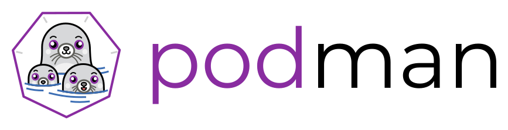

# 2. Introduction to Podman  

## What is Podman?  

Podman, short for "Pod Manager", is an open-source container management tool. It offers functionalities similar to Docker but with some key differences that make it unique and sometimes preferable.



## Why Podman?

1. No Daemon:  
   Unlike Docker, which requires a long-running daemon process, Podman operates as a single, static binary. This means no background service needs to run and no root privileges are required.  

2. Rootless Containers:  
   Podman can run containers without root privileges. This increases security as users don't have to be given elevated permissions.  

3. Pods:  
   Beyond just containers, Podman can manage "pods". Pods are a group of one or more containers under a single *network namespace*. This design aligns closely with *Kubernetes* (often abbreviated as k8s), the leading container orchestration tool. This makes Podman an ideal choice for developers working on applications targeting Kubernetes deployments.

4. Compatibility:  
   Podman is CLI compatible with Docker. Most commands that work with Docker also work with Podman, making migration easier.  

5. Systemd Integration:   
   Podman integrates well with systemd. If you recall, systemd is the system and service manager for Linux. It's responsible for initializing the system and managing services (or daemons). With Podman's integration, it's simpler to manage containers as systemd services.   

6. OCI Compliant:  
   Podman supports Open Container Initiative (OCI) images and runtime, ensuring broad compatibility. The OCI is a set of industry standards to ensure containers work seamlessly across different platforms and tools. It's like agreeing that every email client will be able to read emails, no matter which one you use.

## Guided Exercise: Setting up Podman

In this guided exercise, we will walk you through the steps to install and configure Podman on your cloud instance. Remember, each of you has been assigned an individual instance, so you'll be working in an isolated environment.  

**Prerequisites:**

Ensure you're connected to your cloud instance via SSH. If you're not sure how, refer to the earlier instructions provided.
You should have sudo privileges to execute administrative commands.

*Steps:*  

1. Connect to your cloud instance  
Using the URL, login, and ssh key provided to you.    

2. Update your package repositories:  
Always begin by updating your package repositories to ensure you have access to the latest software.  
`sudo dnf -y update`   

3. Install Podman:  
CentOS repositories come with Podman by default. Install it using:   
`sudo dnf -y install podman` 

4. Verify Podman Installation:  
Check the installed version to ensure Podman was installed correctly:  
   ```bash
      podman --version
      podman version
      podman info
   ``` 

5. Test Podman with a simple container:  
   Let's run a straightforward hello-world container:  
   `podman run hello-world` 

   This command will download the hello-world image (if it's not already present) and run it. If everything works, you'll see a message from the hello-world container.

6. Cleanup:  
   It's good practice to remove containers and images that aren't needed:

   ```bash
    podman rm -a
    podman rmi hello-world
   ```   

Conclusion:

Well done! You've successfully set up and tested Podman on your CentOS cloud instance. As we move through the course, we'll delve into Podman's more intricate and powerful features.

Remember to follow each step carefully and note down any issues or queries. We will address any concerns in a subsequent Q&A session.

